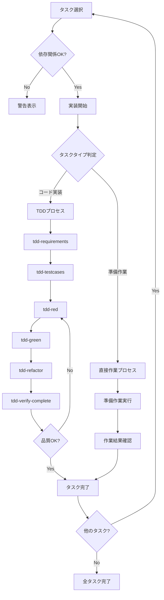

# kairo-implement

## 目的
分割されたタスクを順番に、またはユーザが指定したタスクを実装する。既存のTDDコマンドを活用して品質の高い実装を行う。

## 前提条件
- `docs/tasks/{要件名}-tasks.md` にタスク一覧が存在する
- ユーザがタスクの実装を承認している
- 既存のTDDコマンドが利用可能である
- 実装用のワークスペースが設定されている

## 実行内容

1. **タスクの選択**
   - ユーザが指定したタスクIDを確認
   - 指定がない場合は、依存関係に基づいて次のタスクを自動選択
   - 選択したタスクの詳細を表示

2. **依存関係の確認**
   - 依存タスクが完了しているか確認
   - 未完了の依存タスクがある場合は警告

3. **実装ディレクトリの準備**
   - 現在のワークスペースで作業を行う
   - 必要に応じてディレクトリ構造を確認

4. **実装タイプの判定**
   - タスクの性質を分析（コード実装 vs 準備作業）
   - 実装方式を決定（TDD vs 直接作業）

5. **実装プロセスの実行**

   ### A. **TDDプロセス**（コード実装タスク用）

   a. **要件定義** (`tdd-requirements.md`)
   - タスクの詳細要件を記述
   - 受け入れ基準を明確化

   b. **テストケース作成** (`tdd-testcases.md`)
   - 単体テストケースを作成
   - エッジケースを考慮

   c. **テスト実装** (`tdd-red.md`)
   - 失敗するテストを実装
   - テストが失敗することを確認

   d. **最小実装** (`tdd-green.md`)
   - テストが通る最小限の実装
   - 過度な実装を避ける

   e. **リファクタリング** (`tdd-refactor.md`)
   - コードの品質向上
   - 保守性の改善

   f. **品質確認** (`tdd-verify-complete.md`)
   - 実装の完成度を確認
   - 不足があれば c-f を繰り返す

   ### B. **直接作業プロセス**（準備作業タスク用）

   a. **準備作業の実行**
   - ディレクトリ作成
   - 設定ファイル作成
   - 依存関係のインストール
   - 環境設定

   b. **作業結果の確認**
   - 作業完了の検証
   - 期待された成果物の確認
   - 次のタスクへの準備状況確認

6. **タスクの完了処理**
   - タスクのステータスを更新（タスクファイルのチェックボックスにチェックを入れる）
   - 実装結果をドキュメント化
   - 次のタスクを提案

## 実行フロー



## コマンド実行例

```bash
# 全タスクを順番に実装
$ claude code kairo-implement --all

# 特定のタスクを実装
$ claude code kairo-implement --task TASK-101

# 並行実行可能なタスクを一覧表示
$ claude code kairo-implement --list-parallel

# 現在の進捗を表示
$ claude code kairo-implement --status
```

## 実装タイプ判定基準

### TDDプロセス（コード実装タスク）

以下の条件に当てはまるタスク：

- 新しいコンポーネント、サービス、フック等の実装
- 既存コードの機能追加・修正
- ビジネスロジックの実装
- API実装

**例**: TaskService実装、UIコンポーネント作成、状態管理実装

### 直接作業プロセス（準備作業タスク）

以下の条件に当てはまるタスク：

- プロジェクト初期化・環境構築
- ディレクトリ構造作成
- 設定ファイル作成・更新
- 依存関係のインストール
- ツール設定・設定

**例**: プロジェクト初期化、データベース設定、開発環境設定

## 実装時の注意事項

### TDDプロセス用

1. **テストファースト**
   - 必ずテストを先に書く
   - テストが失敗することを確認してから実装

2. **インクリメンタルな実装**
   - 一度に全てを実装しない
   - 小さなステップで進める

3. **継続的な品質確認**
   - 各ステップで品質を確認
   - 技術的負債を作らない

### 直接作業プロセス用

1. **作業の段階的実行**
   - 依存関係を考慮した順序で実行
   - 各ステップの完了を確認

2. **設定の検証**
   - 作成した設定ファイルの動作確認
   - 環境の正常性チェック

3. **ドキュメントの更新**
   - 実装と同時にドキュメントも更新
   - 他の開発者が理解できるように

## 出力フォーマット

### タスク開始時（TDDプロセス）

```
🚀 タスク TASK-101: ユーザー認証API の実装を開始します

📋 タスク詳細:
- 要件: REQ-101, REQ-102
- 依存: TASK-002 ✅
- 推定時間: 4時間
- 実装タイプ: TDDプロセス

🔄 TDDプロセスを開始します...
```

### タスク開始時（直接作業プロセス）

```
🚀 タスク TASK-003: データベース設定 の実装を開始します

📋 タスク詳細:
- 要件: REQ-402, REQ-006
- 依存: TASK-001 ✅
- 推定時間: 3時間
- 実装タイプ: 直接作業プロセス

🔧 準備作業を開始します...
```

### 各ステップ完了時（TDD）

```
✅ Step 1/6: 要件定義 完了
   ファイル: /implementation/{要件名}/TASK-101/requirements.md

🏃 Step 2/6: テストケース作成 実行中...
```

### 各ステップ完了時（直接作業）

```
✅ Step 1/2: 準備作業実行 完了
   作成ファイル: 8個、設定更新: 3個

🏃 Step 2/2: 作業結果確認 実行中...
```

### タスク完了時（TDD）

```
🎉 タスク TASK-101 が完了しました！

✅ タスクファイルのチェックボックスを更新しました
   - [ ] **タスク完了** → [x] **タスク完了**

📊 実装サマリー:
- 実装タイプ: TDDプロセス
- 作成ファイル: 12個
- テストケース: 25個 (全て成功)
- カバレッジ: 95%
- 所要時間: 3時間45分

📝 次の推奨タスク:
- TASK-102: ユーザー管理API
- TASK-201: ログイン画面（依存関係あり）

続けて実装しますか？ (y/n)
```

### タスク完了時（直接作業）

```
🎉 タスク TASK-003 が完了しました！

✅ タスクファイルのチェックボックスを更新しました
   - [ ] **タスク完了** → [x] **タスク完了**

📊 実装サマリー:
- 実装タイプ: 直接作業プロセス
- 作成ファイル: 8個
- 設定更新: 3個
- 環境確認: 正常
- 所要時間: 2時間30分

📝 次の推奨タスク:
- TASK-004: 状態管理設定
- TASK-101: TaskService実装（依存関係あり）

続けて実装しますか？ (y/n)
```

## エラーハンドリング

- 依存タスク未完了: 警告を表示し、確認を求める
- テスト失敗: 詳細なエラー情報を表示
- ファイル競合: バックアップを作成してから上書き

## 実行後の確認

- 実装したファイルの一覧を表示
- テスト結果のサマリーを表示
- 残りのタスクと進捗率を表示
- 次のタスクの提案を表示
