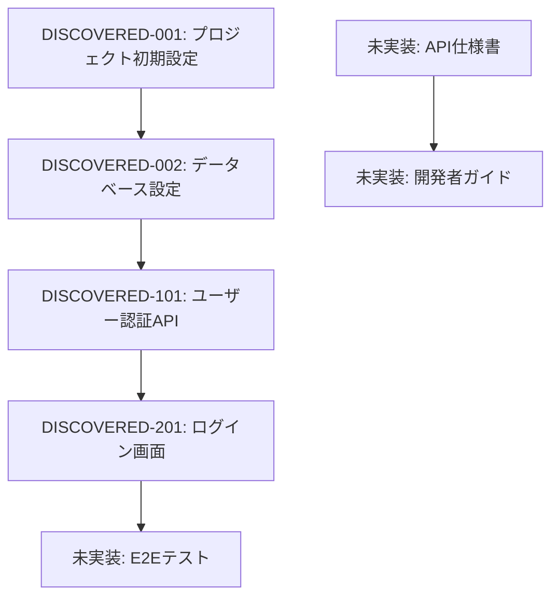

# rev-tasks

## 目的

既存のコードベースを分析し、実装されている機能を特定してタスク一覧として整理する。実装済みの機能から逆算してタスクの構造、依存関係、実装詳細を抽出し、文書化する。

## 前提条件

- 分析対象のコードベースが存在する
- `docs/reverse/` ディレクトリが存在する（なければ作成）
- TypeScript/JavaScript、Python、その他のコードを分析可能

## 実行内容

1. **コードベースの構造分析**
   - ディレクトリ構造の把握
   - 設定ファイルの確認（package.json、tsconfig.json、requirements.txt等）
   - 依存関係の分析

2. **機能コンポーネントの特定**
   - フロントエンドコンポーネント
   - バックエンドサービス/コントローラー
   - データベース関連（モデル、マイグレーション）
   - ユーティリティ関数
   - ミドルウェア

3. **API エンドポイントの抽出**
   - REST API エンドポイント
   - GraphQL リゾルバー
   - WebSocket ハンドラー
   - ルーティング定義

4. **データベース構造の分析**
   - テーブル定義
   - リレーションシップ
   - マイグレーションファイル
   - インデックス設定

5. **UI/UX実装の分析**
   - 画面コンポーネント
   - 状態管理の実装
   - ルーティング
   - スタイリング手法

6. **テスト実装の確認**
   - 単体テストの存在
   - 統合テストの存在
   - E2Eテストの存在
   - テストカバレッジ

7. **タスクの逆算と整理**
   - 実装された機能をタスクとして分解
   - タスクIDの自動割り当て
   - 依存関係の推定
   - 実装工数の推定

8. **ファイルの作成**
   - `docs/reverse/{プロジェクト名}-discovered-tasks.md` として保存
   - 発見されたタスクを構造化して文書化

## 出力フォーマット例

````markdown
# {プロジェクト名} 発見タスク一覧

## 概要

**分析日時**: {分析実行日時}
**対象コードベース**: {パス}
**発見タスク数**: {数}
**推定総工数**: {時間}

## コードベース構造

### プロジェクト情報
- **フレームワーク**: {使用フレームワーク}
- **言語**: {使用言語}
- **データベース**: {使用DB}
- **主要ライブラリ**: {主要な依存関係}

### ディレクトリ構造
```
{ディレクトリツリー}
```

## 発見されたタスク

### 基盤・設定タスク

#### DISCOVERED-001: プロジェクト初期設定

- [x] **タスク完了** (実装済み)
- **タスクタイプ**: DIRECT
- **実装ファイル**: 
  - `package.json`
  - `tsconfig.json`
  - `.env.example`
- **実装詳細**:
  - {発見された設定内容}
- **推定工数**: {時間}

#### DISCOVERED-002: データベース設定

- [x] **タスク完了** (実装済み)
- **タスクタイプ**: DIRECT
- **実装ファイル**: 
  - `src/database/connection.ts`
  - `migrations/001_initial.sql`
- **実装詳細**:
  - {発見されたDB設定内容}
- **推定工数**: {時間}

### API実装タスク

#### DISCOVERED-101: ユーザー認証API

- [x] **タスク完了** (実装済み)
- **タスクタイプ**: TDD
- **実装ファイル**: 
  - `src/auth/auth.controller.ts`
  - `src/auth/auth.service.ts`
  - `src/auth/jwt.strategy.ts`
- **実装詳細**:
  - ログイン/ログアウト機能
  - JWT トークン発行
  - 認証ミドルウェア
- **APIエンドポイント**:
  - `POST /auth/login`
  - `POST /auth/logout`
  - `POST /auth/refresh`
- **テスト実装状況**:
  - [x] 単体テスト: `auth.service.spec.ts`
  - [x] 統合テスト: `auth.controller.spec.ts`
  - [ ] E2Eテスト: 未実装
- **推定工数**: {時間}

### UI実装タスク

#### DISCOVERED-201: ログイン画面

- [x] **タスク完了** (実装済み)
- **タスクタイプ**: TDD
- **実装ファイル**: 
  - `src/components/Login/LoginForm.tsx`
  - `src/components/Login/LoginForm.module.css`
  - `src/hooks/useAuth.ts`
- **実装詳細**:
  - ログインフォーム
  - バリデーション機能
  - エラーハンドリング
- **UI/UX実装状況**:
  - [x] レスポンシブデザイン
  - [x] ローディング状態
  - [x] エラー表示
  - [ ] アクセシビリティ: 部分的実装
- **テスト実装状況**:
  - [x] コンポーネントテスト: `LoginForm.test.tsx`
  - [ ] E2Eテスト: 未実装
- **推定工数**: {時間}

## 未実装・改善推奨事項

### 不足しているテスト

- [ ] **E2Eテストスイート**: 主要ユーザーフローのテスト
- [ ] **パフォーマンステスト**: API応答時間テスト
- [ ] **セキュリティテスト**: 認証・認可テスト

### コード品質改善

- [ ] **TypeScript型安全性**: 一部でany型の使用
- [ ] **エラーハンドリング**: 統一的なエラー処理
- [ ] **ログ出力**: 構造化ログの実装

### ドキュメント不足

- [ ] **API仕様書**: OpenAPI/Swagger未実装
- [ ] **開発者ガイド**: セットアップ手順書
- [ ] **デプロイ手順書**: 本番環境構築手順

## 依存関係マップ



## 実装パターン分析

### アーキテクチャパターン
- **実装パターン**: {発見されたパターン}
- **状態管理**: {使用されている状態管理}
- **認証方式**: {実装されている認証方式}

### コーディングスタイル
- **命名規則**: {発見された命名規則}
- **ファイル構成**: {ファイル構成パターン}
- **エラーハンドリング**: {エラー処理パターン}

## 技術的負債・改善点

### パフォーマンス
- {発見されたパフォーマンス課題}

### セキュリティ
- {発見されたセキュリティ課題}

### 保守性
- {発見された保守性課題}

## 推奨次ステップ

1. **不足テストの実装** - 特にE2Eテストスイート
2. **ドキュメント整備** - API仕様書とセットアップガイド
3. **コード品質改善** - TypeScript型安全性とエラーハンドリング
4. **セキュリティ強化** - 認証・認可の詳細レビュー

````

## 分析対象ファイルの自動検出

### フロントエンド
- React: `*.tsx`, `*.jsx`, `*.ts`, `*.js`
- Vue: `*.vue`, `*.ts`, `*.js`
- Angular: `*.component.ts`, `*.service.ts`, `*.module.ts`

### バックエンド
- Node.js: `*.ts`, `*.js` (Express, NestJS等)
- Python: `*.py` (Django, FastAPI等)
- Java: `*.java` (Spring Boot等)

### データベース
- SQL: `*.sql`, `migrations/*`
- ORM: モデルファイル、設定ファイル

### 設定ファイル
- `package.json`, `tsconfig.json`, `webpack.config.js`
- `requirements.txt`, `Pipfile`, `pyproject.toml`
- `pom.xml`, `build.gradle`

## 実行コマンド例

```bash
# カレントディレクトリを分析
claude code rev-tasks

# 特定ディレクトリを分析
claude code rev-tasks --path ./backend

# 特定の技術スタックに絞って分析
claude code rev-tasks --tech react,nodejs

# 詳細分析（テストカバレッジ等も含む）
claude code rev-tasks --detailed

# 出力形式指定
claude code rev-tasks --format json
```

## 実行後の確認

- 発見されたタスク数と推定工数を表示
- 実装済み/未実装の機能一覧を表示
- 技術的負債・改善推奨事項をサマリー表示
- 次のリバースエンジニアリングステップ（設計書生成等）を提案 