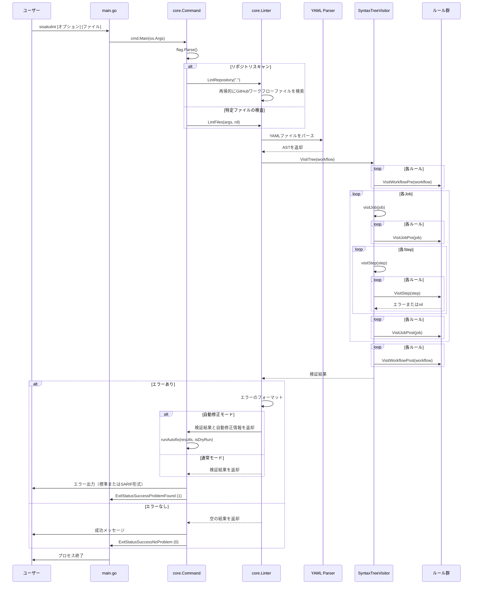
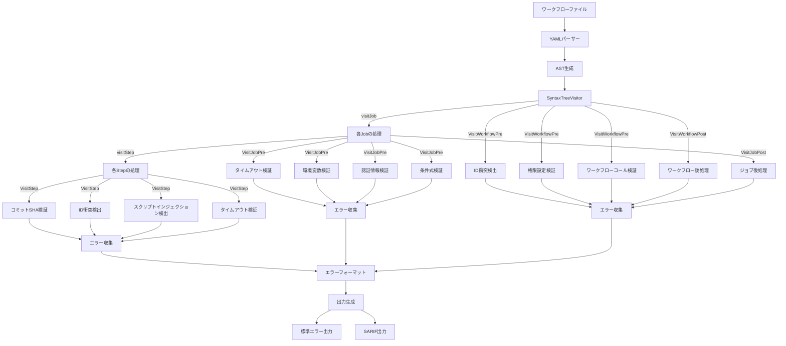
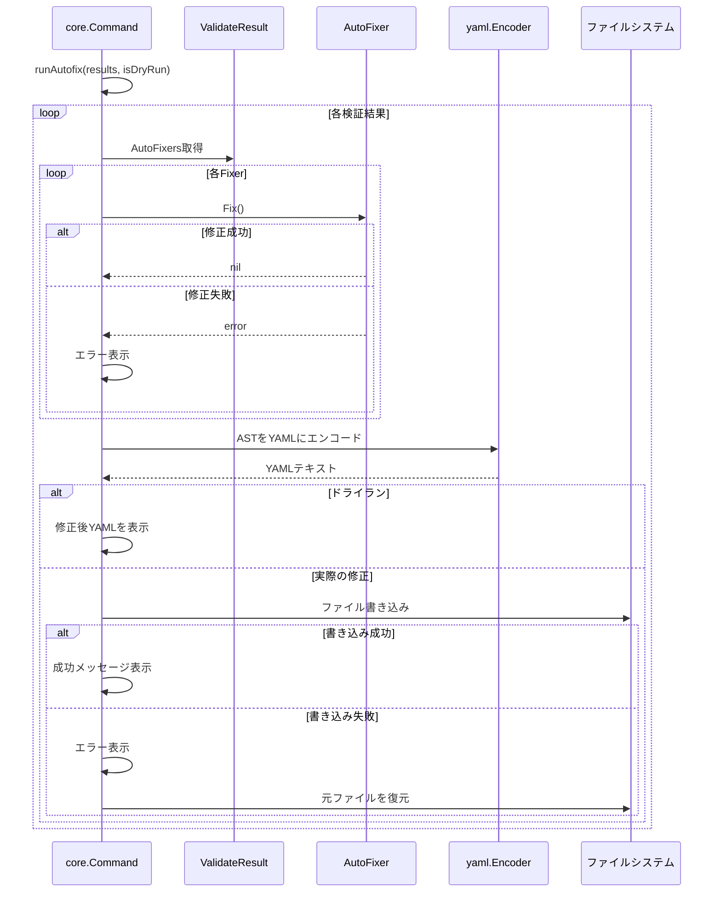
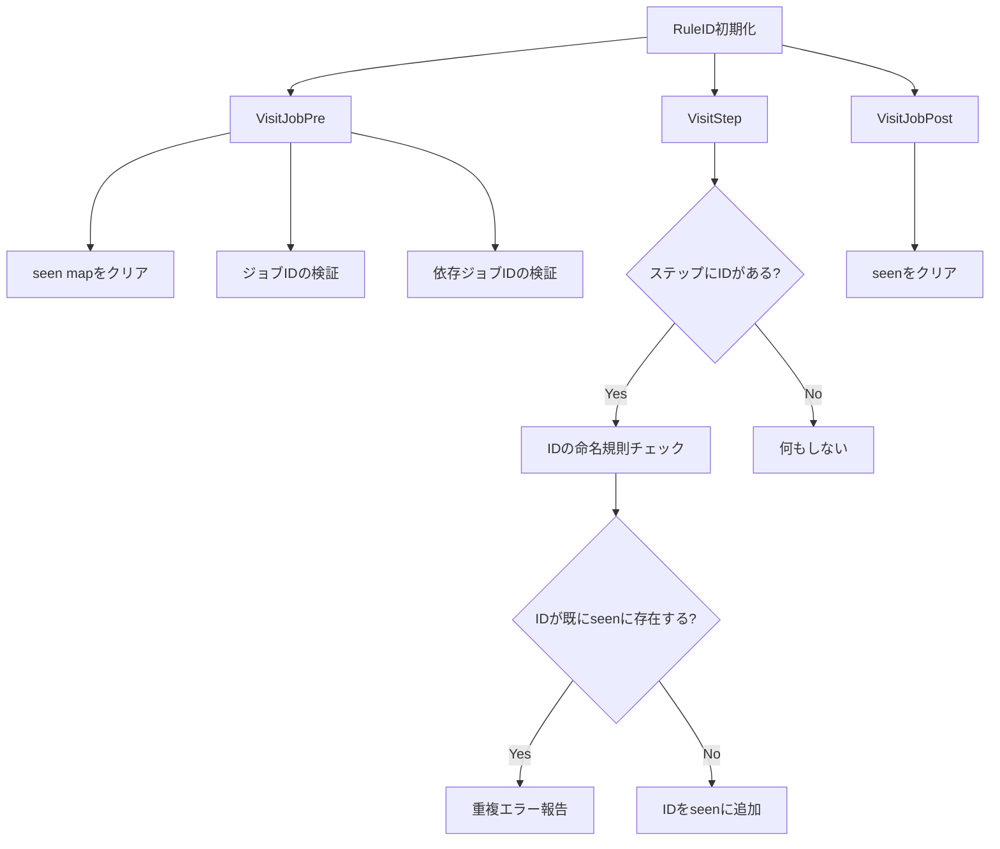
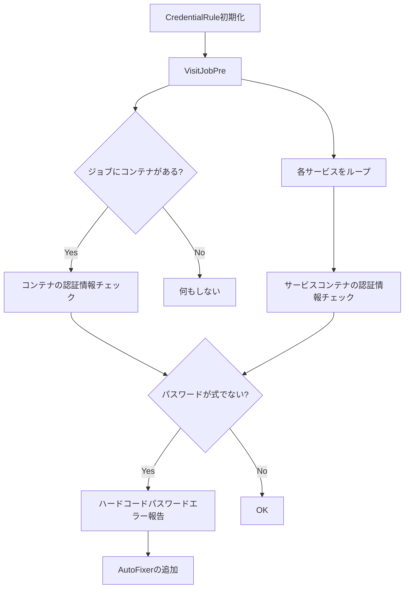
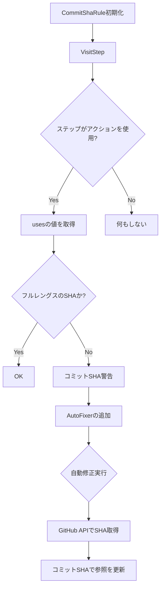
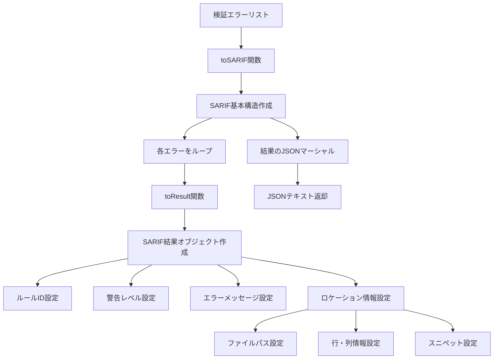
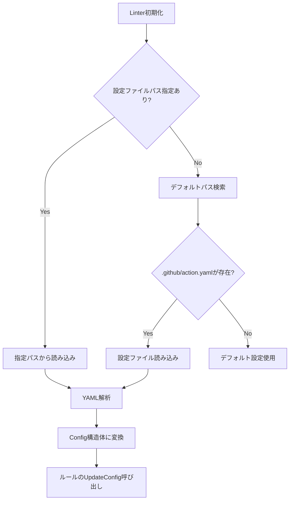
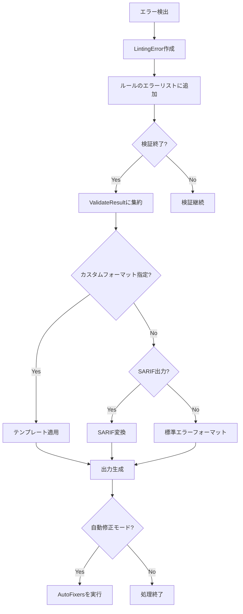

# sisakulint データフロー図（逆生成）

## コマンドライン実行フロー

### 基本実行フロー


## ルール検証フロー

### 一般的なルール検証プロセス


## 自動修正フロー

### 自動修正プロセス


## ルール別データフロー

### ID衝突検出ルールのデータフロー


### 認証情報検出ルールのデータフロー


### スクリプトインジェクション検出ルールのデータフロー
```mermaid
flowchart TD
    A[IssueInjection初期化] --> B[VisitJobPre]
    B --> C[各ステップをループ]
    
    C --> D{ステップがExecRunか?}
    D -->|Yes| E[runコマンドを取得]
    D -->|No| F[次のステップへ]
    
    E --> G[コマンドを行に分割]
    G --> H[各行をループ]
    
    H --> I{${{ が存在する?}
    I -->|Yes| J{}} が存在する?}
    I -->|No| K[次の行へ]
    
    J -->|Yes| L[スクリプトインジェクション警告]
    J -->|No| M{複数行にまたがるか確認}
    
    M -->|Yes| N[複数行にまたがる式を検出]
    M -->|No| O[式構文エラー]
    
    N --> P[スクリプトインジェクション警告]
```

### コミットSHA検証ルールのデータフロー


## SARIF出力生成フロー

### SARIF変換プロセス


## 設定ファイル読み込みフロー



## メモリと状態管理

### 主要な状態保持コンポーネント

1. **Command構造体**
   - Stdin, Stdout, Stderrを保持
   - 短命: コマンド実行期間のみ有効

2. **Linter構造体**
   - プロジェクト情報
   - エラー/ログ出力先
   - 設定情報
   - 長命: リント処理全体を通じて有効

3. **Rule実装**
   - 検出されたエラーのリスト
   - 自動修正情報
   - ルール特有の状態（例: RuleIDのseen map）
   - 中命: 特定のファイルの検証中のみ有効

4. **VisitorPattern**
   - ルールのリスト（passes）
   - デバッグ出力先
   - 中命: ファイル処理中のみ有効

### 状態管理の特徴

- **イミュータブル設計志向**: 多くの構造体は初期化後に内部状態を変更しない
- **明示的な依存関係**: 依存オブジェクトは構造体初期化時に渡される
- **スコープ制限**: データはできるだけ必要なスコープでのみ保持
- **ルールごとの独立性**: 各ルールはOthers状態を共有せず独立して動作

## エラー処理フロー

