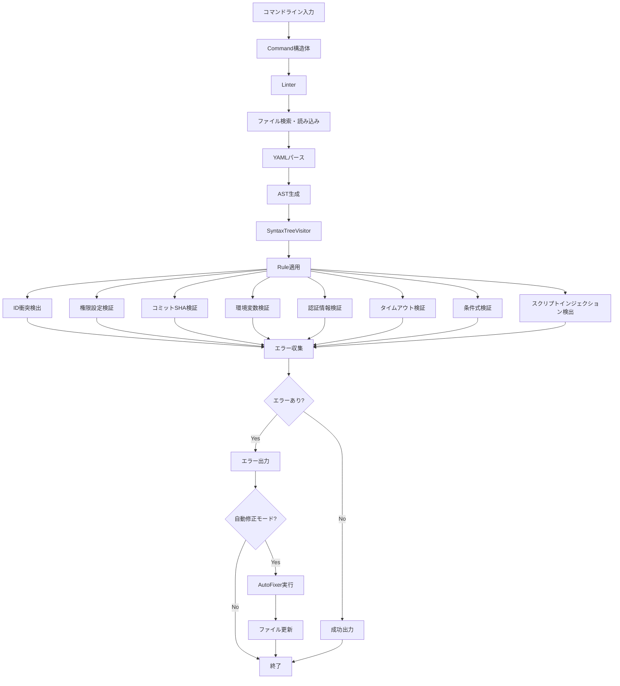

# sisakulint 設計書索引

## 概要

sisakulintは、GitHub Actionsのワークフローファイル（.github/workflows/*.yml または .yaml）を対象とした静的解析ツールです。このツールは、GitHub Actionsのセキュリティ機能に関するガイドラインに従った静的解析を行い、潜在的な問題や脆弱性を検出します。

このドキュメントは、sisakulintのソースコードからリバースエンジニアリングにより生成された設計書のインデックスです。

## 生成日時

**分析日時**: 2025-08-19

## 設計ドキュメント一覧

| ドキュメント名 | 説明 | リンク |
|--------------|------|------|
| アーキテクチャ設計 | sisakulintの全体アーキテクチャと設計パターン | [sisakulint-architecture.md](sisakulint-architecture.md) |
| データフロー図 | 主要プロセスのデータフロー | [sisakulint-dataflow.md](sisakulint-dataflow.md) |
| API仕様書 | コマンドライン引数とプログラミングインターフェース | [sisakulint-api-specs.md](sisakulint-api-specs.md) |
| 型定義 | 主要データ構造とタイプの定義 | [sisakulint-types.md](sisakulint-types.md) |
| 発見タスク一覧 | 実装されている機能のタスクリスト | [sisakulint-discovered-tasks.md](sisakulint-discovered-tasks.md) |

## sisakulintの主な特徴

1. **セキュリティ検証**
   - ハードコードされた認証情報の検出
   - スクリプトインジェクション脆弱性の検出
   - コミットSHAの検証
   - 権限設定の検証

2. **コード品質チェック**
   - ID衝突検出
   - 環境変数名の検証
   - 条件式の検証
   - タイムアウト設定の検証

3. **ユーザビリティ機能**
   - 自動修正機能
   - 詳細なエラーレポート
   - SARIF出力サポート（reviewdog連携）
   - カスタム出力フォーマット

## 技術スタック

- **言語**: Go 1.24.0
- **主要ライブラリ**:
  - gopkg.in/yaml.v3（YAMLパース）
  - github.com/fatih/color（カラー出力）
  - github.com/google/go-github（GitHub API）
  - github.com/haya14busa/go-sarif（SARIF出力）

## アーキテクチャ概略図

## 主要コンポーネント

| コンポーネント | 役割 | 説明 |
|--------------|------|------|
| Command | コマンドライン処理 | 入力を処理し、適切なLinterメソッドを呼び出す |
| Linter | リント処理の中核 | ファイルの検索、パース、検証を管理 |
| SyntaxTreeVisitor | AST走査 | ビジターパターンでAST走査を実装 |
| Rule | 検証ルール | 様々なセキュリティ・品質ルールを実装 |
| AutoFixer | 自動修正 | 検出された問題の自動修正を実装 |

## データフロー概要

1. **入力処理**
   - コマンドライン引数のパース
   - ターゲットファイルの特定（引数指定またはリポジトリスキャン）

2. **ファイル処理**
   - YAMLファイルの読み込み
   - AST（抽象構文木）への変換

3. **検証処理**
   - ルールの適用（ビジターパターンによるAST走査）
   - エラーの収集

4. **出力処理**
   - エラーのフォーマット（標準または SARIF）
   - 結果の表示

5. **自動修正**（オプション）
   - 修正可能な問題の自動修正
   - 修正後のファイルの書き込み

## デザインパターン

1. **ビジターパターン**
   - AST構造のトラバースに使用
   - `TreeVisitor`インターフェースを通じて実装

2. **プラグインパターン**
   - 検証ルールの拡張に使用
   - `Rule`インターフェースを通じて実装

3. **ストラテジーパターン**
   - 自動修正方法の選択に使用
   - `AutoFixer`インターフェースを通じて実装

4. **ファクトリーメソッドパターン**
   - ルールインスタンスの作成に使用
   - 各ルールの作成関数を通じて実装

## 拡張性

sisakulintは、以下の方法で拡張可能です：

1. **新しいルールの追加**
   - `Rule`インターフェースを実装
   - 新しい検証ロジックを記述
   - `createDefaultRules`に追加

2. **新しい出力フォーマットの追加**
   - カスタムフォーマット関数を実装
   - `errorFormatter.AddCustomFormat`で登録

3. **自動修正機能の拡張**
   - `AutoFixer`インターフェースを実装
   - 適切な修正ロジックを記述

## 将来的な改善点

1. **テストカバレッジの向上**
   - 特にE2Eテストの追加
   - 未テストのルール実装のテスト追加

2. **パフォーマンス最適化**
   - 大規模リポジトリでの並列処理の改善

3. **ドキュメント充実**
   - コードコメントの改善
   - API仕様書の充実化

4. **新しいルールの追加**
   - OWASPのCI/CDセキュリティリスクトップ10の完全カバー