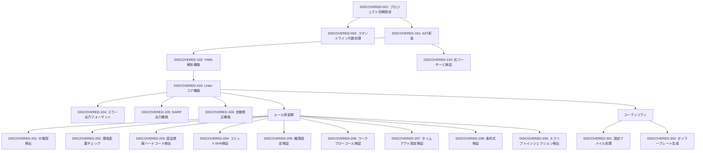

# sisakulint 発見タスク一覧

## 概要

**分析日時**: 2025-08-19
**対象コードベース**: /Users/atsushi.sada/go/src/github.com/ultra-supara/sisakulint
**発見タスク数**: 22
**推定総工数**: 360時間

## コードベース構造

### プロジェクト情報
- **フレームワーク**: 独自フレームワーク
- **言語**: Go 1.24.0
- **データベース**: なし
- **主要ライブラリ**: 
  - github.com/fatih/color v1.18.0
  - github.com/google/go-github/v68 v68.0.0
  - github.com/haya14busa/go-sarif v0.0.0-20240630170108-a3ba8d79599f
  - gopkg.in/yaml.v3 v3.0.1

### ディレクトリ構造
```
.
├── cmd/
│   └── sisakulint/      # コマンドラインツールのエントリーポイント
│       └── main.go
├── pkg/
│   ├── ast/             # YAML抽象構文木の定義
│   │   ├── ast_func.go
│   │   └── ast_type.go
│   ├── core/            # コア機能
│   │   ├── command.go   # コマンドライン処理
│   │   ├── linter.go    # メインのリンター機能
│   │   ├── ※各種rule実装ファイル
│   │   ├── autofixer.go # 自動修正機能
│   │   ├── sarif.go     # SARIF出力機能
│   │   └── ...
│   └── expressions/     # 式パーサー
│       └── ...
└── script/             # ユーティリティスクリプト
    └── ...
```

## 発見されたタスク

### 基盤・設定タスク

#### DISCOVERED-001: プロジェクト初期設定

- [x] **タスク完了** (実装済み)
- **タスクタイプ**: DIRECT
- **実装ファイル**: 
  - `cmd/sisakulint/main.go`
  - `go.mod`
- **実装詳細**:
  - Go言語でのプロジェクト構造設計
  - エントリポイントの実装
  - 依存関係の設定
- **推定工数**: 8時間

#### DISCOVERED-002: コマンドライン引数処理機能

- [x] **タスク完了** (実装済み)
- **タスクタイプ**: DIRECT
- **実装ファイル**: 
  - `pkg/core/command.go`
- **実装詳細**:
  - コマンドライン引数のパース機能
  - ヘルプメッセージの表示
  - 各種オプションの処理（-debug, -format, -fix等）
- **推定工数**: 16時間

### コア機能実装タスク

#### DISCOVERED-101: AST(抽象構文木)実装

- [x] **タスク完了** (実装済み)
- **タスクタイプ**: TDD
- **実装ファイル**: 
  - `pkg/ast/ast_type.go`
  - `pkg/ast/ast_func.go`
- **実装詳細**:
  - YAML形式のGitHub Actionsワークフローファイル用のAST定義
  - 位置情報の保持機能
  - 文字列、真偽値、数値などの基本型の定義
  - イベント型の定義
- **推定工数**: 40時間

#### DISCOVERED-102: YAML解析機能

- [x] **タスク完了** (実装済み)
- **タスクタイプ**: DIRECT
- **実装ファイル**: 
  - `pkg/core/parse_main.go`
  - `pkg/core/parse_sub.go`
- **実装詳細**:
  - YAMLファイルの読み込み
  - AST構造への変換
  - パース中のエラーハンドリング
- **推定工数**: 32時間

#### DISCOVERED-103: Linter コア機能

- [x] **タスク完了** (実装済み)
- **タスクタイプ**: DIRECT
- **実装ファイル**: 
  - `pkg/core/linter.go`
  - `pkg/core/visit.go`
  - `pkg/core/visitor.go`
- **実装詳細**:
  - リントエンジンの実装
  - AST訪問者パターンの実装
  - ルールの適用と実行の管理
- **推定工数**: 48時間

#### DISCOVERED-104: エラー出力フォーマット機能

- [x] **タスク完了** (実装済み)
- **タスクタイプ**: DIRECT
- **実装ファイル**: 
  - `pkg/core/errorformatter.go`
- **実装詳細**:
  - エラーメッセージのフォーマット
  - 位置情報の表示
  - カラー出力
- **推定工数**: 16時間

#### DISCOVERED-105: SARIF出力機能

- [x] **タスク完了** (実装済み)
- **タスクタイプ**: DIRECT
- **実装ファイル**: 
  - `pkg/core/sarif.go`
- **実装詳細**:
  - SARIFフォーマットへの変換
  - reviewdog連携のサポート
- **推定工数**: 8時間

#### DISCOVERED-106: 自動修正機能

- [x] **タスク完了** (実装済み)
- **タスクタイプ**: DIRECT
- **実装ファイル**: 
  - `pkg/core/autofixer.go`
- **実装詳細**:
  - 検出された問題の自動修正機能
  - Fixerインターフェースの定義
  - Job, Stepレベルの修正サポート
- **推定工数**: 24時間

### ルール実装タスク

#### DISCOVERED-201: ID衝突検出ルール

- [x] **タスク完了** (実装済み)
- **タスクタイプ**: TDD
- **実装ファイル**: 
  - `pkg/core/idrule.go`
  - `pkg/core/idrule_test.go`
- **実装詳細**:
  - ジョブIDやステップIDの重複検出
  - 命名規則の検証
- **テスト実装状況**:
  - [x] 単体テスト: `idrule_test.go`
- **推定工数**: 16時間

#### DISCOVERED-202: 環境変数チェックルール

- [x] **タスク完了** (実装済み)
- **タスクタイプ**: TDD
- **実装ファイル**: 
  - `pkg/core/environmentvariablerule.go`
  - `pkg/core/environmentvariablerule_test.go`
- **実装詳細**:
  - 環境変数名の形式チェック
  - 無効な文字（&, =, スペース）の検出
- **テスト実装状況**:
  - [x] 単体テスト: `environmentvariablerule_test.go`
- **推定工数**: 12時間

#### DISCOVERED-203: 認証情報ハードコード検出ルール

- [x] **タスク完了** (実装済み)
- **タスクタイプ**: DIRECT
- **実装ファイル**: 
  - `pkg/core/credential.go`
- **実装詳細**:
  - コンテナセクション内のハードコードされたパスワード検出
  - 自動修正機能の提供
- **推定工数**: 10時間

#### DISCOVERED-204: コミットSHA検証ルール

- [x] **タスク完了** (実装済み)
- **タスクタイプ**: DIRECT
- **実装ファイル**: 
  - `pkg/core/commitsha.go`
- **実装詳細**:
  - アクションrefがフルレングスのコミットSHAでない場合の検出
  - GitHub APIを使用したSHA情報取得と検証
- **推定工数**: 16時間

#### DISCOVERED-205: 権限設定検証ルール

- [x] **タスク完了** (実装済み)
- **タスクタイプ**: TDD
- **実装ファイル**: 
  - `pkg/core/permissionrule.go`
  - `pkg/core/permissionrule_test.go`
- **実装詳細**:
  - 権限スコープの検証
  - 無効な権限値の検出
- **テスト実装状況**:
  - [x] 単体テスト: `permissionrule_test.go`
- **推定工数**: 16時間

#### DISCOVERED-206: ワークフローコール検証ルール

- [x] **タスク完了** (実装済み)
- **タスクタイプ**: DIRECT
- **実装ファイル**: 
  - `pkg/core/workflowcall.go`
- **実装詳細**:
  - 再利用可能なワークフロー呼び出しの検証
  - 入力パラメータの検証
- **推定工数**: 24時間

#### DISCOVERED-207: タイムアウト設定検証ルール

- [x] **タスク完了** (実装済み)
- **タスクタイプ**: DIRECT
- **実装ファイル**: 
  - `pkg/core/timeout_minutes.go`
- **実装詳細**:
  - ジョブとステップのタイムアウト設定の検証
  - 自動修正機能の提供
- **推定工数**: 8時間

#### DISCOVERED-208: 条件式検証ルール

- [x] **タスク完了** (実装済み)
- **タスクタイプ**: TDD
- **実装ファイル**: 
  - `pkg/core/conditionalrule.go`
  - `pkg/core/conditionalrule_test.go`
- **実装詳細**:
  - 常に真または偽となる条件式の検出
  - 式構文の正しさ検証
- **テスト実装状況**:
  - [x] 単体テスト: `conditionalrule_test.go`
- **推定工数**: 10時間

#### DISCOVERED-209: スクリプトインジェクション脆弱性検出ルール

- [x] **タスク完了** (実装済み)
- **タスクタイプ**: DIRECT
- **実装ファイル**: 
  - `pkg/core/issueinjection.go`
- **実装詳細**:
  - run ステップ内での ${{ ... }} 式の直接使用の検出
  - 潜在的なスクリプトインジェクション脆弱性の検出
- **推定工数**: 12時間

#### DISCOVERED-210: 式パーサーと検証機能

- [x] **タスク完了** (実装済み)
- **タスクタイプ**: DIRECT
- **実装ファイル**: 
  - `pkg/expressions/expression.go`
  - `pkg/expressions/parser.go`
  - `pkg/expressions/tokenizer.go`
  - `pkg/core/exprrule.go`
- **実装詳細**:
  - GitHub Actionsの式構文のパース機能
  - 式の正しさ検証
- **推定工数**: 32時間

### ユーティリティタスク

#### DISCOVERED-301: 設定ファイル処理機能

- [x] **タスク完了** (実装済み)
- **タスクタイプ**: DIRECT
- **実装ファイル**: 
  - `pkg/core/config.go`
- **実装詳細**:
  - 設定ファイルの読み込み
  - デフォルト設定の生成
- **推定工数**: 8時間

#### DISCOVERED-302: ボイラープレート生成機能

- [x] **タスク完了** (実装済み)
- **タスクタイプ**: DIRECT
- **実装ファイル**: 
  - `pkg/core/boilerplate.go`
- **実装詳細**:
  - テンプレートファイルの生成
- **推定工数**: 4時間

## 未実装・改善推奨事項

### 不足しているテスト

- [ ] **E2Eテストスイート**: 実際のGitHub Actionsワークフローファイルを使用した統合テスト
- [ ] **カバレッジ改善**: 現在テストがないルール実装のテスト追加

### コード品質改善

- [ ] **エラーハンドリング**: より一貫したエラーハンドリング
- [ ] **ドキュメンテーション**: コードコメントの改善
- [ ] **命名規則の統一**: 一部の変数・関数名の命名規則の統一

### ドキュメント不足

- [ ] **開発者ガイド**: 貢献者向けのガイド
- [ ] **ルール仕様書**: 各ルールの詳細な仕様書

## 依存関係マップ



## 実装パターン分析

### アーキテクチャパターン
- **実装パターン**: Visitor パターン（AST処理）
- **プラグイン型ルール実装**: ルールがインターフェースを実装する形で追加可能
- **自動修正機能**: Fixer インターフェースを通じて各ルールが修正機能を提供

### コーディングスタイル
- **命名規則**: キャメルケース (camelCase)
- **ファイル構成**: 機能単位でのファイル分割
- **エラーハンドリング**: 詳細なエラーメッセージと位置情報付きのエラー報告

## 技術的負債・改善点

### パフォーマンス
- 大規模リポジトリでの複数ファイル処理時の並列処理最適化が可能

### セキュリティ
- コミットSHA検証に使用するGitHub API呼び出しの認証情報管理が改善可能

### 保守性
- 一部のルール実装でテストが不足している
- コメント不足の箇所がある

## 推奨次ステップ

1. **テスト改善** - 特にE2Eテストの追加と既存ルールのテストカバレッジ向上
2. **ドキュメント整備** - 開発者向けドキュメントとルール仕様書の作成
3. **パフォーマンス最適化** - 大規模リポジトリ向けの並列処理の改善
4. **新規ルール追加** - OWASPのCI/CDセキュリティリスクトップ10に対応する追加ルールの実装