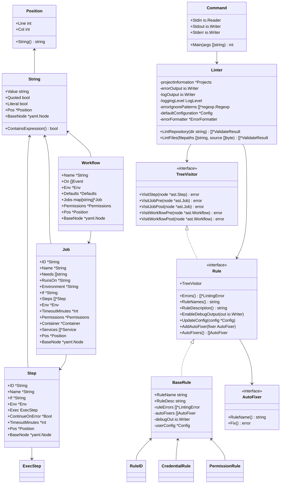

# sisakulint 型定義（逆生成）

このドキュメントでは、sisakulintプロジェクトで使用されている主要な型定義を整理して説明します。

## 目次

1. [基本型](#基本型)
2. [AST型](#ast型)
3. [コア型](#コア型)
   - [コマンド関連](#コマンド関連)
   - [リンター関連](#リンター関連)
   - [ルール関連](#ルール関連)
   - [自動修正関連](#自動修正関連)
4. [式パーサー型](#式パーサー型)
5. [型の依存関係図](#型の依存関係図)

## 基本型

### 位置情報

```go
// Position はファイル内の位置を表します。
type Position struct {
	// Line は位置の行番号です。この値は1から始まります。
	Line int
	// Col は位置の列番号です。この値は1から始まります。
	Col int
}

// String returns a string representation of a Position.
func (pos *Position) String() string {
	return fmt.Sprintf("line:%d,col:%d", pos.Line, pos.Column)
}
```

### 基本値型

```go
// String represents generic string value in YAML file with position.
type String struct {
	// Value is a raw value of the string.
	Value string
	// Quoted represents the string is quoted with ' or " in the YAML source.
	Quoted bool
	// Literal represents the string is literal style in the YAML source.
	Literal bool
	// Pos is a position of the string in source.
	Pos *Position
	// BaseNode is a base node of the string in the YAML source.
	BaseNode *yaml.Node
}

// Bool はYAMLファイル内の汎用的な真偽値を位置情報付きで表します。
type Bool struct {
	// Value は真偽値の生の値です。
	Value bool
	// Expression はこのセクションに対して式構文 ${{ }} が使用された場合の文字列です。
	Expression *String
	// Pos はソース内の位置情報です。
	Pos *Position
}

// Int はYAMLファイル内の汎用的な整数値を位置情報付きで表します。
type Int struct {
	// Value は整数値の生の値です。
	Value int
	// Expression はこのセクションに対して式構文 ${{ }} が使用された場合の文字列です。
	Expression *String
	// Pos はソース内の位置情報です。
	Pos *Position
}

// Float はYAMLファイル内の汎用的な浮動小数点数を位置情報付きで表します。
type Float struct {
	// Value は浮動小数点数の生の値です。
	Value float64
	// Expression はこのセクションに対して式構文 ${{ }} が使用された場合の文字列です。
	Expression *String
	// Pos はソース内の位置情報です。
	Pos *Position
}
```

## AST型

### イベント関連

```go
// Event インターフェースは'on'セクション内のワークフローイベントを表します。
type Event interface {
	// EventName はこのワークフローをトリガーするイベントの名前を返します。
	EventName() string
}

// WebhookEventFilter はWebhookイベントのフィルターを表します。例えば 'branches', 'paths-ignore' などです。
type WebhookEventFilter struct {
	// Name はフィルターの名前です。例えば 'branches', 'tags' など。
	Name *String
	// Values はフィルター値のリストです。
	Values []*String
}

// WebhookEvent はWebhookイベントに基づくイベントタイプを表します。
type WebhookEvent struct {
	// Hook はWebhookイベントの名前です。
	Hook *String
	// Types はWebhookイベントのタイプのリストです。
	Types []*String
	// Branches は 'branches' フィルターです。
	Branches *WebhookEventFilter
	// BranchesIgnore は 'branches-ignore' フィルターです。
	BranchesIgnore *WebhookEventFilter
	// Tags は 'tags' フィルターです。
	Tags *WebhookEventFilter
	// TagsIgnore は 'tags-ignore' フィルターです。
	TagsIgnore *WebhookEventFilter
	// Paths は 'paths' フィルターです。
	Paths *WebhookEventFilter
	// PathsIgnore は 'paths-ignore' フィルターです。
	PathsIgnore *WebhookEventFilter
	// Workflows は 'workflow_run' イベントによってトリガーされるワークフロー名のリストです。
	Workflows []*String
	// Pos はソース内の位置情報です。
	Pos *Position
}

// WorkflowCallEvent represents 'workflow_call' event type.
// It is triggered when a workflow is called by another workflow.
type WorkflowCallEvent struct {
	// Inputs defines the inputs that can be passed to the called workflow.
	Inputs map[string]*WorkflowCallEventInput
	// Outputs defines the outputs that the called workflow will provide.
	Outputs map[string]*WorkflowCallEventOutput
	// Secrets defines the secrets that can be passed to the called workflow.
	Secrets map[string]*WorkflowCallEventSecret
	// Pos is a position in the source.
	Pos *Position
}
```

### ワークフロー構造

```go
// Workflow represents a GitHub Actions workflow.
type Workflow struct {
	// Name is the name of the workflow.
	Name *String
	// On is a list of events that trigger the workflow.
	On []Event
	// Env is a map of environment variables available to all jobs and steps in the workflow.
	Env *Env
	// Defaults is a map of default settings that will apply to all jobs in the workflow.
	Defaults *Defaults
	// Jobs is a map of job ID to Job.
	Jobs map[string]*Job
	// Permissions is the top-level permissions applied to all jobs.
	Permissions *Permissions
	// Pos is a position in the source.
	Pos *Position
	// BaseNode is a base node of the workflow in the YAML source.
	BaseNode *yaml.Node
}

// Job represents a job in a workflow.
type Job struct {
	// ID is the ID of the job.
	ID *String
	// Name is the name of the job.
	Name *String
	// Needs is a list of jobs that must complete successfully before this job will run.
	Needs []string
	// RunsOn is the type of machine to run the job on.
	RunsOn *String
	// Environment is the environment to run the job in.
	Environment *String
	// If is a condition that must be true for the job to run.
	If *String
	// Steps is a list of steps to run in the job.
	Steps []*Step
	// Env is a map of environment variables available to all steps in the job.
	Env *Env
	// TimeoutMinutes is the maximum number of minutes to let a job run.
	TimeoutMinutes *Int
	// Permissions is the permissions for the job.
	Permissions *Permissions
	// WorkflowCall is the workflow call configuration.
	WorkflowCall *WorkflowCall
	// Container is the container configuration.
	Container *Container
	// Services is a map of service name to service container.
	Services []*Service
	// Pos is a position in the source.
	Pos *Position
	// BaseNode is a base node of the job in the YAML source.
	BaseNode *yaml.Node
}

// Step represents a step in a job.
type Step struct {
	// ID is the ID of the step.
	ID *String
	// Name is the name of the step.
	Name *String
	// If is a condition that must be true for the step to run.
	If *String
	// Env is a map of environment variables available to the step.
	Env *Env
	// Exec is the action or command to run.
	Exec ExecStep
	// ContinueOnError determines whether to continue the job if the step fails.
	ContinueOnError *Bool
	// TimeoutMinutes is the maximum number of minutes to let a step run.
	TimeoutMinutes *Int
	// Pos is a position in the source.
	Pos *Position
	// BaseNode is a base node of the step in the YAML source.
	BaseNode *yaml.Node
}
```

### 実行ステップ

```go
// ExecStep is an interface for step execution.
type ExecStep interface {
	Kind() ExecKind
}

// ExecKind is a kind of step execution.
type ExecKind int

const (
	ExecKindRun ExecKind = iota
	ExecKindAction
)

// ExecRun represents a run step.
type ExecRun struct {
	// Run is the command to run.
	Run *String
	// Shell is the shell to use.
	Shell *String
	// WorkingDirectory is the working directory to run the command in.
	WorkingDirectory *String
}

// ExecAction represents an action step.
type ExecAction struct {
	// Uses is the action to use.
	Uses *String
	// With is a map of inputs for the action.
	With map[string]*String
}
```

### その他の構造体

```go
// Env represents a map of environment variables.
type Env struct {
	// Expression is the expression to evaluate for the environment variables.
	Expression *String
	// Vars is a map of environment variable name to value.
	Vars []*EnvVar
	// Pos is a position in the source.
	Pos *Position
	// BaseNode is a base node of the environment variables in the YAML source.
	BaseNode *yaml.Node
}

// EnvVar represents an environment variable.
type EnvVar struct {
	// Name is the name of the environment variable.
	Name *String
	// Value is the value of the environment variable.
	Value *String
}

// Permissions represents permissions for the GITHUB_TOKEN.
type Permissions struct {
	// All is the permission level for all scopes.
	All *String
	// Scopes is a list of permission scopes.
	Scopes []*PermissionScope
	// Pos is a position in the source.
	Pos *Position
	// BaseNode is a base node of the permissions in the YAML source.
	BaseNode *yaml.Node
}

// PermissionScope represents a permission scope.
type PermissionScope struct {
	// Name is the name of the scope.
	Name *String
	// Value is the permission level for the scope.
	Value *String
	// Pos is a position in the source.
	Pos *Position
}

// Container represents a container to run a job or service in.
type Container struct {
	// Image is the Docker image to use.
	Image *String
	// Env is a map of environment variables available to the container.
	Env *Env
	// Ports is a list of ports to expose.
	Ports []*String
	// Volumes is a list of volumes to mount.
	Volumes []*String
	// Options is a list of Docker options.
	Options *String
	// Credentials is the credentials to use to authenticate to the Docker registry.
	Credentials Credentials
	// Pos is a position in the source.
	Pos *Position
	// BaseNode is a base node of the container in the YAML source.
	BaseNode *yaml.Node
}

// Credentials represents credentials for a container.
type Credentials struct {
	// Username is the username to use.
	Username *String
	// Password is the password to use.
	Password *String
	// Pos is a position in the source.
	Pos *Position
	// BaseNode is a base node of the credentials in the YAML source.
	BaseNode *yaml.Node
}
```

## コア型

### コマンド関連

```go
// Commandは全体のsisakulintコマンドを表します。与えられたstdin/stdout/stderrは入出力に使用
type Command struct {
	// Stdinはstdinから入力を読み込むためのリーダーです
	Stdin io.Reader
	// Stdoutはstdoutに出力を書き込むためのライターです
	Stdout io.Writer
	// Stderrはstderrに出力を書き込むためのライターです
	Stderr io.Writer
}

// 終了コード定数
const (
	// ExitStatusSuccessNoProblem はコマンドが成功し、問題が見つからなかった場合の終了ステータス
	ExitStatusSuccessNoProblem = 0
	// ExitStatusSuccessProblemFound はコマンドが成功し、問題が見つかった場合の終了ステータス
	ExitStatusSuccessProblemFound = 1
	// ExitStatusInvalidCommandOption はコマンドラインオプションの解析に失敗した場合の終了ステータス
	ExitStatusInvalidCommandOption = 2
	// ExitStatusFailure はワークフローをチェック中に何らかの致命的なエラーが発生してコマンドが停止した場合の終了ステータス
	ExitStatusFailure = 3
)
```

### リンター関連

```go
// LogLevel は Linter インスタンスで使用されるログレベルを表す型
type LogLevel int

const (
	// LogLevelNoOutputは、ログ出力が無いことを示す。
	LogLevelNoOutput LogLevel = 0
	// LogLevelDetailedOutputは、詳細なログ出力が有効であることを示す。
	LogLevelDetailedOutput = 1
	// LogLevelAllOutputIncludingDebugは、デバッグ情報を含むすべてのログ出力が有効であることを示す。
	LogLevelAllOutputIncludingDebug = 2
)

// OutputColorBehaviorは、出力の色付けの挙動を表す
type OutputColorBehavior int

const (
	// AutoColorは、出力の色付けを自動的に決定
	AutoColor OutputColorBehavior = iota
	// AlwaysColorは、常に出力を色付け
	AlwaysColor
	// NeverColorは、出力を色付けしない
	NeverColor
)

// LinterOptions は Linter のオプションを表す構造体
type LinterOptions struct {
	// IsVerboseOutputEnabledは、詳細なログ出力が有効であるかどうかを示すflag
	IsVerboseOutputEnabled bool
	// IsDebugOutputEnabledは、Debuglogの出力が有効であるかどうかを示すflag
	IsDebugOutputEnabled bool
	// LogOutputDestinationは、ログ出力を出力するためのio.Writerオブジェクト
	LogOutputDestination io.Writer
	// OutputColorOptionは、エラー出力の色付けのオプション
	OutputColorOption OutputColorBehavior
	// BoilerplateGenerationは、boilerplateを生成するためのディレクトリパス
	BoilerplateGeneration string
	// ShellcheckExecutableは、shellcheckを実行するための実行可能ファイル
	ShellcheckExecutable string
	// ErrorIgnorePatternsは、エラーをフィルタリングするための正規表現のリスト
	ErrorIgnorePatterns []string
	// ConfigurationFilePathは、設定ファイルのパス
	ConfigurationFilePath string
	// BoilerplateFilePathは、boilerplateファイルのパス
	BoilerplateFilePath string
	// CustomErrorMessageFormatは、エラーメッセージをフォーマットするためのカスタムテンプレート
	CustomErrorMessageFormat string
	// StdinInputFileNameは、標準入力から読み込む際のファイル名
	StdinInputFileName string
	// CurrentWorkingDirectoryPathは、現在の作業ディレクトリのパス
	CurrentWorkingDirectoryPath string
	// OnCheckRulesModifiedは、チェックルールの追加や削除を行うフック
	OnCheckRulesModified func([]Rule) []Rule
}

// Linterは、workflowをlintするための構造体
type Linter struct {
	// projectsは、プロジェクト情報を管理する構造体
	projectInformation *Projects
	// errorOutputは、Linterからのエラー出力に使用されるio.Writerオブジェクト
	errorOutput io.Writer
	// logOutputは、ログ出力に使用されるio.Writerオブジェクト
	logOutput io.Writer
	// loggingLevelは、Linterのログレベルを示す
	loggingLevel LogLevel
	// shellcheckExecutableは、shellcheckの実行可能ファイルのパスまたは名前
	shellcheckExecutablePath string
	// errorIgnorePatternsは、エラーを無視するための正規表現パターンのリスト
	errorIgnorePatterns []*regexp.Regexp
	// defaultConfigurationは、sisakulintの default config を表す
	defaultConfiguration *Config
	// boilerplateGenerationは、boilerplateを生成する
	boilerplateGeneration *Boiler
	// errorFormatterは、エラーメッセージをカスタムフォーマットで出力するためのformatter
	errorFormatter *ErrorFormatter
	// currentWorkingDirectoryは、現在の作業ディレクトリのパス
	currentWorkingDirectory string
}

// ValidateResult は検証結果を表す構造体
type ValidateResult struct {
	FilePath       string
	ParsedWorkflow *ast.Workflow
	Source         []byte
	Errors         []*LintingError
	AutoFixers     []AutoFixer
}

// LintingError はリントエラーを表す構造体
type LintingError struct {
	FilePath string
	Position *ast.Position
	RuleName string
	Message  string
}

// Config は設定を表す構造体
type Config struct {
	Rules   map[string]map[string]interface{} `yaml:"rules"`
	Common  CommonConfig                      `yaml:"common"`
	Version string                            `yaml:"version"`
}

// CommonConfig は共通設定を表す構造体
type CommonConfig struct {
	Ignores []string `yaml:"ignores"`
}

// Projects はプロジェクト情報を表す構造体
type Projects struct {
	ProjectRoot string
}

// TemplateFields はエラー出力テンプレートのフィールドを表す構造体
type TemplateFields struct {
	Filepath string
	Line     int
	Column   int
	Message  string
	Type     string
	Snippet  string
}
```

### ルール関連

```go
// TreeVisitorはworkflowのsyntax'streeをトラバースするためのinterface
type TreeVisitor interface {
	VisitStep(node *ast.Step) error
	VisitJobPre(node *ast.Job) error
	VisitJobPost(node *ast.Job) error
	VisitWorkflowPre(node *ast.Workflow) error
	VisitWorkflowPost(node *ast.Workflow) error
}

// SyntaxTreeVisitorはworkflowのsyntax'streeをトラバースするためのinterface
type SyntaxTreeVisitor struct {
	passes []TreeVisitor
	debugW io.Writer
}

// Rule は検証ルールを表すインターフェース
type Rule interface {
	TreeVisitor
	Errors() []*LintingError
	RuleNames() string
	RuleDescription() string
	EnableDebugOutput(out io.Writer)
	UpdateConfig(config *Config)
	AddAutoFixer(fixer AutoFixer)
	AutoFixers() []AutoFixer
}

// BaseRuleはruleの基本構造体
type BaseRule struct {
	RuleName   string
	RuleDesc   string
	ruleErrors []*LintingError
	autoFixers []AutoFixer
	debugOut   io.Writer
	userConfig *Config
}

// ルール実装例（ID衝突検出ルール）
type RuleID struct {
	BaseRule
	seen map[string]*ast.Position
}

// ルール実装例（認証情報ハードコード検出ルール）
type CredentialRule struct {
	BaseRule
}

// ルール実装例（権限設定検証ルール）
type PermissionRule struct {
	BaseRule
}
```

### 自動修正関連

```go
// AutoFixer は自動修正機能を表すインターフェース
type AutoFixer interface {
	RuleName() string
	Fix() error
}

// BaseAutoFixer は AutoFixer の基本実装
type BaseAutoFixer struct {
	ruleName string
}

// StepFixer はステップレベルの修正インターフェース
type StepFixer interface {
	RuleNames() string
	FixStep(node *ast.Step) error
}

// JobFixer はジョブレベルの修正インターフェース
type JobFixer interface {
	RuleNames() string
	FixJob(node *ast.Job) error
}

// 内部実装構造体
type stepFixer struct {
	BaseAutoFixer
	step  *ast.Step
	fixer StepFixer
}

type jobFixer struct {
	BaseAutoFixer
	job   *ast.Job
	fixer JobFixer
}

type funcFixer struct {
	BaseAutoFixer
	fixer func() error
}
```

## 式パーサー型

```go
// Token は字句解析トークンを表す
type Token struct {
	Type     TokenType
	Value    string
	Line     int
	Column   int
	Position int
}

// TokenType はトークンの種類を表す
type TokenType int

const (
	TokenEOF TokenType = iota
	TokenIdentifier
	TokenNumber
	TokenString
	TokenOperator
	TokenDot
	TokenComma
	TokenOpenParen
	TokenCloseParen
	TokenOpenBracket
	TokenCloseBracket
	// その他のトークン型...
)

// Parser は構文解析器を表す
type Parser struct {
	tokens    []*Token
	pos       int
	errorList []*ParseError
	current   *Token
}

// ParseError は構文解析エラーを表す
type ParseError struct {
	Message  string
	Token    *Token
	ExpectedTokenTypes []TokenType
}

// Expression は式のインターフェース
type Expression interface {
	// Position returns the position of the expression
	Position() (int, int)
	// String returns a string representation of the expression
	String() string
}

// 式の実装（例）
type BinaryExpression struct {
	Left     Expression
	Operator *Token
	Right    Expression
}

type UnaryExpression struct {
	Operator *Token
	Right    Expression
}

type Identifier struct {
	Name *Token
}

type StringLiteral struct {
	Value *Token
}

type NumberLiteral struct {
	Value *Token
}

type BooleanLiteral struct {
	Value *Token
}

type NullLiteral struct {
	Value *Token
}

type CallExpression struct {
	Callee    Expression
	OpenParen *Token
	Args      []Expression
	Commas    []*Token
	CloseParen *Token
}
```

## 型の依存関係図



## 主要な型の関連性

1. **AST構造**
   - `Position` → `String` → AST要素（`Workflow`, `Job`, `Step`）
   - AST要素の階層: `Workflow` → `Job` → `Step` → `ExecStep`

2. **ビジターパターン**
   - `TreeVisitor` インターフェース → `Rule` インターフェース → `BaseRule` → 具体的なルール実装

3. **自動修正機能**
   - `Rule` → `AutoFixer` インターフェース → 具体的なFixer実装（`stepFixer`, `jobFixer`, `funcFixer`）

4. **コマンドライン処理**
   - `Command` → `Linter` → `Rule` および `TreeVisitor`